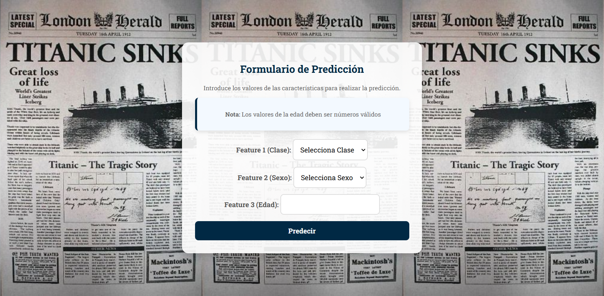

# Titanic Survival Predictor



## Descripción

**Titanic Survival Predictor** es una aplicación web creada como una prueba de concepto para demostrar cómo podemos llevar un modelo de Machine Learning más allá de las predicciones básicas y convertirlo en un producto completo, listo para usarse.

El modelo predice si una persona habría sobrevivido al Titanic basándose en tres inputs: **edad**, **sexo** y **clase de camarote**. Lo interesante no está solo en la predicción, sino en la experiencia de usuario creada:

- 🔗 **Conexión con IA:** La app utiliza la API de Gemini para generar una explicación narrativa que complementa la predicción y la hace más significativa para el usuario.
- 📀 **Conexión a base de datos:** Las predicciones realizadas se almacenan en una base de datos PostgreSQL, permitiendo generar un gráfico acumulado de predicciones (sobrevivó o no sobrevivó).
- 🌐 **Despliegue web:** Una interfaz amigable desarrollada con Flask que devuelve predicciones y gráficos.
- 📦 **Dockerización y despliegue:** La aplicación está dockerizada y desplegada en Google Cloud, transformándola en un producto accesible para cualquiera.

---

## Características principales

- **Predicciones basadas en Machine Learning**: Predice si un pasajero habría sobrevivido o no al Titanic.
- **Explicación enriquecida con IA**: Genera una narrativa utilizando la API de Gemini para justificar las predicciones.
- **Gráficos interactivos**: Devuelve un gráfico con los resultados acumulados de predicciones realizadas, conectado a una base de datos PostgreSQL.
- **Interfaz amigable**: Diseñada para que cualquier usuario pueda interactuar fácilmente.
- **Dockerización**: El proyecto puede ejecutarse en cualquier máquina que tenga Docker.

---

## Instalación y configuración

### Requisitos previos

- **Python 3.10.16**
- **Docker (opcional)**
- **PostgreSQL** (con configuración especificada en el archivo `.env`).
- **API de Gemini** (con configuración especificada en el archivo `.env`).
- **Un archivo `.env`** con las variables de entorno necesarias: conexión a la base de datos y claves de la API de Gemini.

### Instalación

1. Clona este repositorio:
   ```bash
   git clone <URL_DEL_REPOSITORIO>
   cd <NOMBRE_DEL_REPOSITORIO>
   ```

2. Instala las dependencias:
   ```bash
   pip install -r requirements.txt
   ```

3. Configura tu base de datos PostgreSQL:
   - Asegúrate de tener PostgreSQL instalado y corriendo.
   - Crea una base de datos y ajusta las credenciales en el archivo `.env`.

4. Ejecuta la aplicación localmente:
   ```bash
   python app.py
   ```

5. (Opcional) Dockeriza la aplicación:
   ```bash
   docker build -t titanic-predictor .
   docker run -p 5000:5000 titanic-predictor
   ```

---

## Uso

1. Accede a la aplicación en tu navegador (localmente: `http://127.0.0.1:5000`).
2. Introduce los valores de **edad**, **sexo** y **clase de camarote**.
3. Obtén la predicción del modelo (0: no sobrevivió, 1: sobrevivió).
4. Explora la narrativa generada por la API de Gemini.
5. Visualiza el gráfico con las predicciones acumuladas, basado en los datos almacenados en la base de datos PostgreSQL.

---

## Tecnologías usadas

- **Lenguaje:** Python  
- **Framework web:** Flask  
- **Bibliotecas:** Pandas, Matplotlib, SQLAlchemy  
- **Base de datos:** PostgreSQL  
- **Docker:** Para la contenedorización del proyecto  
- **Google Cloud:** Para el despliegue en la web  
- **API:** Gemini (para explicaciones enriquecidas)  

---

## Enlaces importantes

- **Prueba la aplicación:** [Enlace a la web](https://titanic-884322312100.us-central1.run.app/)
- 
---

## Licencia

Este proyecto está bajo la licencia MIT. Consulta el archivo `LICENSE` para más información.
